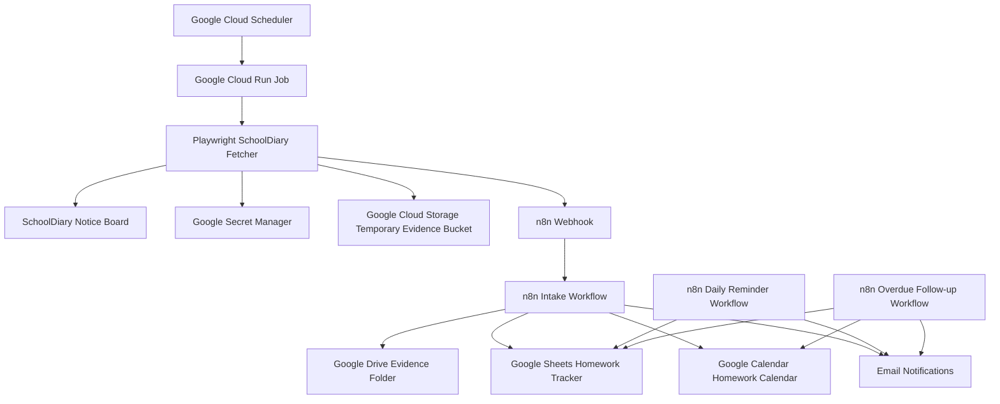

# Architecture Design

## 1. Purpose

This document defines the architecture for the SchoolDiary Homework Automation system.

It explains how scheduled capture, SchoolDiary notice extraction, evidence preservation, n8n orchestration, Google Sheet tracking, Google Calendar due-date visibility, Google Drive evidence storage, and email notifications work together.

This document is architecture-level only. It does not define implementation code, browser selectors, detailed payload schemas, n8n node-level workflow configuration, or deployment commands. Those details are covered in later stage-specific design documents.

## 2. Architecture Overview

The system uses a scheduled, cloud-hosted architecture.

Google Cloud Scheduler triggers a Google Cloud Run Job on a configured schedule. The Cloud Run Job runs a short-lived Playwright-based fetcher that logs in to the configured SchoolDiary Notice Board, captures notices, preserves evidence, and posts structured output to an n8n webhook.

n8n Cloud owns the downstream workflow: payload validation, deduplication, homework itemization, evidence storage in Google Drive, tracker updates in Google Sheets, due-date event creation in Google Calendar, and email notifications.

The architecture avoids dependency on a local laptop, home machine, or always-on browser session.



## 3. System Context

The system interacts with the following external systems.

| System | Role |
|---|---|
| SchoolDiary Notice Board | Source system for homework notices |
| Google Cloud Scheduler | Starts the scheduled capture process |
| Google Cloud Run Job | Executes the short-lived browser automation job |
| Google Secret Manager | Stores runtime secrets used by the fetcher |
| Google Cloud Storage | Temporary handoff store for downloaded or captured evidence |
| n8n Cloud | Orchestrates validation, deduplication, itemization, storage, calendar, and notifications |
| Google Sheets | Master operational homework tracker |
| Google Drive | Final user-facing evidence store |
| Google Calendar | Shared due-date visibility |
| Email service | MVP notification and reminder channel |

The system should remain generic and configurable. The repository must not include real SchoolDiary URLs, credentials, real student information, real guardian information, real homework data, screenshots, PDFs, browser cookies, or session state.

## 4. Component Architecture

### 4.1 Google Cloud Scheduler

Google Cloud Scheduler owns the capture schedule.

Responsibilities:

- Trigger the Cloud Run Job at configured times.
- Support future schedule changes without code changes.
- Avoid reliance on a local machine.

It does not own parsing, evidence handling, task creation, or notifications.

### 4.2 Google Cloud Run Job

Google Cloud Run Job owns the scheduled capture execution.

Responsibilities:

- Start a short-lived container on schedule.
- Load runtime configuration.
- Access required secrets.
- Run the Playwright fetcher.
- Produce structured capture output.
- Exit cleanly with meaningful status.

The Cloud Run Job should not become an always-on service. It should run, complete the capture process, post results to n8n, and exit.

### 4.3 Playwright SchoolDiary Fetcher

The Playwright fetcher owns SchoolDiary interaction.

Responsibilities:

- Authenticate to SchoolDiary using configured secrets.
- Open the configured SchoolDiary Notice Board URL.
- Extract visible notice text and metadata.
- Detect and download attachments where available.
- Preserve publicly accessible links where included in notices.
- Capture screenshot and/or PDF evidence where applicable.
- Upload downloaded or captured evidence to temporary Google Cloud Storage.
- Generate a structured payload for n8n.
- Post the payload to the configured n8n webhook.

The fetcher should keep SchoolDiary-specific browser selectors isolated from the rest of the codebase.

### 4.4 Google Cloud Storage Temporary Evidence Bucket

Google Cloud Storage is a temporary handoff layer for downloaded or captured files.

Responsibilities:

- Store downloaded attachments temporarily.
- Store generated screenshots or PDFs temporarily.
- Provide file references to n8n for downstream processing.

Google Cloud Storage is not the final user-facing evidence repository in the MVP.

### 4.5 n8n Webhook

The n8n webhook is the boundary between the capture layer and the orchestration layer.

Responsibilities:

- Receive structured payloads from the Cloud Run Job.
- Validate the webhook token or shared secret.
- Validate required payload fields.
- Reject malformed or unauthenticated requests.
- Start the n8n intake workflow.

### 4.6 n8n Intake Workflow

The n8n intake workflow owns downstream processing after capture.

Responsibilities:

- Validate the incoming payload.
- Check for duplicate notices using tracker data.
- Use LLM-assisted logic to itemize notices into homework tasks.
- Upload final file evidence to Google Drive where applicable.
- Preserve public links as source references where file capture is not needed.
- Write or update homework rows in Google Sheets.
- Create or update due-date events in Google Calendar.
- Send new-homework notification emails.

### 4.7 n8n Reminder and Overdue Workflows

Reminder and overdue workflows run separately from capture.

Responsibilities:

- Read open homework records from Google Sheets.
- Identify due today, due tomorrow, overdue, and needs-review items.
- Send daily reminder emails.
- Send guardian-focused overdue follow-up emails.
- Update calendar entries where needed.

### 4.8 Google Sheets Homework Tracker

Google Sheets is the MVP master operational tracker.

Responsibilities:

- Store structured homework records.
- Store source notice identifiers or hashes.
- Store due dates and task status.
- Store evidence links.
- Store calendar event references.
- Support deduplication and reminder workflows.

Google Sheets is used instead of a database for MVP simplicity.

### 4.9 Google Drive Evidence Folder

Google Drive is the final user-facing file evidence store.

Responsibilities:

- Store final copies of downloaded attachments.
- Store generated screenshots or PDFs where applicable.
- Provide stable evidence links to the student, guardians, and configured recipients.

### 4.10 Google Calendar Homework Calendar

Google Calendar provides due-date visibility.

Responsibilities:

- Create events for homework tasks with due dates.
- Provide a shared calendar view.
- Support reminder and overdue context.
- Maintain links back to tracker rows or evidence where applicable.

### 4.11 Email Notifications

Email is the MVP notification channel.

Responsibilities:

- Notify configured recipients when new homework is captured.
- Send daily pending reminders.
- Send overdue or needs-review follow-ups.

WhatsApp and other messaging channels are not part of MVP architecture.

## 5. Runtime Flow — Capture Run

A capture run follows this sequence:

1. Google Cloud Scheduler triggers the configured Cloud Run Job.
2. Cloud Run starts the fetcher container.
3. The fetcher loads runtime configuration.
4. The fetcher retrieves secrets from the configured secret source.
5. The fetcher starts a Playwright browser session.
6. The fetcher authenticates to SchoolDiary.
7. The fetcher opens the configured SchoolDiary Notice Board URL.
8. The fetcher extracts relevant notices and metadata.
9. The fetcher identifies attachments and public links.
10. The fetcher downloads attachments where available and permitted.
11. The fetcher preserves publicly accessible links as source references.
12. The fetcher captures screenshots or PDFs where applicable.
13. The fetcher uploads downloaded or captured file evidence to Google Cloud Storage.
14. The fetcher builds a structured JSON payload.
15. The fetcher posts the payload to the n8n webhook.
16. n8n validates the webhook request.
17. n8n checks for duplicate notices.
18. n8n itemizes notices into homework tasks.
19. n8n uploads final file evidence to Google Drive where applicable.
20. n8n updates Google Sheets.
21. n8n creates or updates Google Calendar events.
22. n8n sends email notifications.
23. The Cloud Run Job exits cleanly.

## 6. Runtime Flow — Reminder and Overdue Runs

Reminder and overdue workflows are independent of the SchoolDiary capture job.

### 6.1 Daily Reminder Flow

1. n8n runs the daily reminder workflow on a configured schedule.
2. n8n reads open homework rows from Google Sheets.
3. n8n groups items by status and due date.
4. n8n sends a consolidated reminder email to configured recipients.
5. n8n updates reminder-related metadata where applicable.

### 6.2 Overdue Follow-up Flow

1. n8n runs the overdue follow-up workflow on a configured schedule.
2. n8n reads open homework rows from Google Sheets.
3. n8n identifies items due today or overdue.
4. n8n sends guardian-focused follow-up email.
5. n8n updates calendar entries where applicable.

### 6.3 Optional Weekly Summary Flow

A later workflow may provide weekly summary reporting.

Potential summary categories:

- Completed tasks.
- Open tasks.
- Overdue tasks.
- Items requiring review.
- Upcoming due dates.

The weekly summary is optional and does not block MVP.

## 7. Data Flow

At a high level, data moves through the system as follows:

```text
SchoolDiary Notice Board
        ↓
Playwright Fetcher
        ↓
Structured notice payload
        ↓
n8n Intake Workflow
        ↓
Structured homework tasks
        ↓
Google Sheets / Google Calendar / Google Drive / Email
```

Data categories:

| Data Category | Source | Destination |
|---|---|---|
| Notice text | SchoolDiary | n8n, Google Sheets |
| Notice metadata | SchoolDiary | n8n, Google Sheets |
| Attachments | SchoolDiary | GCS temporary handoff, Google Drive final store |
| Public links | SchoolDiary | n8n payload, Google Sheets, notifications |
| Screenshots/PDF captures | Fetcher | GCS temporary handoff, Google Drive final store |
| Homework tasks | n8n / LLM parser | Google Sheets, Google Calendar, notifications |
| Tracker status | Google Sheets | Reminder and overdue workflows |
| Calendar references | Google Calendar | Google Sheets |
| Evidence links | Google Drive or public source | Google Sheets, notifications |

## 8. Evidence Flow

Evidence may include:

1. Original attachments such as PDFs or images.
2. Publicly accessible links included in notices.
3. Screenshot or PDF capture of the SchoolDiary notice.
4. Extracted notice text where useful.

Evidence handling depends on evidence type.

| Evidence Type | Handling |
|---|---|
| Downloaded attachment | Downloaded by fetcher, temporarily stored in GCS, finally stored in Google Drive |
| Screenshot or PDF capture | Created by fetcher, temporarily stored in GCS, finally stored in Google Drive |
| Publicly accessible link | Preserved as a source reference in payload, tracker, and notification |
| Extracted notice text | Stored in the tracker where useful |

Evidence flow for files:

```text
SchoolDiary attachment or generated capture
        ↓
Cloud Run local temporary storage
        ↓
Google Cloud Storage temporary handoff
        ↓
n8n intake workflow
        ↓
Google Drive final evidence folder
        ↓
Google Sheet evidence link
        ↓
Email notification evidence link
```

Evidence flow for public links:

```text
SchoolDiary notice public link
        ↓
Fetcher structured payload
        ↓
n8n intake workflow
        ↓
Google Sheet source reference
        ↓
Email notification source reference
```

Public links should not be mirrored into file storage unless a later design document explicitly requires that behavior.

## 9. Component Boundaries

Clear component boundaries are required to prevent unnecessary coupling.

### 9.1 Cloud Run Job Owns

- Runtime startup and shutdown.
- Configuration loading.
- Secret access for SchoolDiary and webhook posting.
- Browser automation execution.
- SchoolDiary authentication.
- Notice Board navigation.
- Notice extraction.
- Attachment download.
- Public link preservation.
- Evidence screenshot/PDF capture.
- Temporary GCS upload.
- Posting structured payloads to n8n.

### 9.2 n8n Owns

- Webhook validation.
- Payload validation.
- Deduplication against the tracker.
- LLM-assisted homework itemization.
- Final evidence storage in Google Drive.
- Google Sheet row creation and updates.
- Google Calendar event creation and updates.
- Email notifications.
- Daily reminder workflow.
- Overdue follow-up workflow.
- Optional weekly summary workflow.

### 9.3 Google Sheets Owns

- Master operational homework tracker.
- Status tracking.
- Dedupe references.
- Evidence and calendar references.

### 9.4 Google Drive Owns

- Final user-facing file evidence.
- Stable evidence links for recipients.

### 9.5 Google Calendar Owns

- Due-date visibility.
- Calendar-based reminder context.
- Links to task evidence where applicable.

### 9.6 Google Cloud Storage Owns

- Temporary handoff for downloaded or captured file evidence only.
- It is not the long-term evidence system for MVP.

## 10. Trust Boundaries and Secrets

The system crosses multiple trust boundaries.

| Boundary | Description | Control |
|---|---|---|
| Public repository | Code and docs are visible publicly | No credentials, real data, screenshots, URLs, cookies, or tokens |
| SchoolDiary portal | Authenticated source system | Credentials stored outside git |
| Cloud Run runtime | Executes fetcher | Secrets injected securely |
| n8n webhook | Receives capture payload | Webhook token or shared secret required |
| Google Workspace | Stores tracker, evidence, and calendar | Access controlled by configured account permissions |
| Email recipients | Receive homework details | Send only to configured recipients |

Secrets must not be stored in source control.

Sensitive values include:

- SchoolDiary username.
- SchoolDiary password.
- n8n webhook URL.
- n8n webhook token.
- Google service account keys.
- Browser session cookies.
- Playwright storage state.
- Real SchoolDiary Notice Board URLs.
- Real student or guardian data.

Secrets should be stored in:

- Google Secret Manager.
- n8n credential storage.
- Environment variables.
- Local `.env` files excluded from git.

## 11. Failure Boundaries

Each component owns specific failure handling.

| Failure Area | Owning Component | Expected Behavior |
|---|---|---|
| Schedule does not trigger | Google Cloud Scheduler | Surface in Google Cloud logs and monitoring |
| Cloud Run Job fails to start | Google Cloud Run | Record failed execution and exit status |
| Secret unavailable | Cloud Run Job | Stop run and log safe error |
| SchoolDiary login fails | Playwright fetcher | Stop capture and alert through configured failure path |
| Notice Board layout changes | Playwright fetcher | Fail visibly; do not create invalid tasks |
| Attachment download fails | Playwright fetcher | Continue where possible and mark evidence incomplete |
| GCS upload fails | Playwright fetcher | Log safe error and fail or degrade based on severity |
| n8n webhook rejects payload | n8n webhook | Return failure response and log validation issue |
| Duplicate notice detected | n8n intake workflow | Skip duplicate task creation |
| LLM itemization fails | n8n intake workflow | Create raw `Needs Review` tracker item where possible |
| Due date unclear | n8n intake workflow | Create `Needs Review` item and avoid calendar event |
| Google Drive upload fails | n8n intake workflow | Preserve temporary reference and flag evidence error |
| Google Sheet update fails | n8n intake workflow | Stop downstream task creation and alert |
| Google Calendar update fails | n8n intake workflow | Keep tracker row and flag calendar error |
| Email send fails | n8n workflow | Log and retry where practical |

The system should avoid silent failure. Failures should be visible through logs, tracker status, or notification where appropriate.

## 12. Deployment Topology

The MVP deployment topology is:

```text
Google Cloud Project
├── Cloud Scheduler
├── Cloud Run Job
├── Secret Manager
└── Cloud Storage temporary evidence bucket

n8n Cloud
├── Intake webhook workflow
├── Daily reminder workflow
├── Overdue follow-up workflow
└── Optional weekly summary workflow

Google Workspace
├── Google Sheet homework tracker
├── Google Drive evidence folder
├── Google Calendar homework calendar
└── Email account or email delivery channel
```

This deployment model is intentionally simple:

- No local machine dependency.
- No always-on VM.
- No database in MVP.
- No custom web app in MVP.
- No WhatsApp integration in MVP.

## 13. Configuration Model

Configuration should be externalized and should not be hardcoded.

Configuration categories:

| Category | Examples |
|---|---|
| SchoolDiary configuration | Notice Board URL, username, password |
| Runtime configuration | Timezone, maximum notices per run, headless mode |
| Google Cloud configuration | Project ID, bucket name, evidence prefix |
| n8n configuration | Webhook URL, webhook token |
| Workflow configuration | reminder schedule, overdue schedule, recipient lists |
| Evidence configuration | capture screenshots, download attachments, preserve public links |
| Notification configuration | email subject format, recipient list |

Public files may include placeholder examples only.

Real values must be stored outside git.

## 14. Scaling and Performance Assumptions

The MVP is designed for low-volume household usage.

Assumptions:

- A small number of SchoolDiary capture runs per day.
- A small number of notices per run.
- A small number of attachments per notice.
- A small configured recipient list.
- Google Sheets is sufficient as the master tracker.
- Google Drive is sufficient as the final evidence store.
- Email is sufficient as the MVP notification channel.

The system is not initially designed for:

- Large-scale multi-school operation.
- High-volume document ingestion.
- Large attachment processing pipelines.
- Complex analytics.
- Real-time messaging guarantees.

If future usage expands, later architecture revisions may introduce:

- Database-backed tracker.
- Dedicated queue.
- Dedicated document extraction service.
- More formal observability.
- Multi-student and multi-school tenancy.

## 15. Non-Functional Requirements

| Requirement | Expected Behavior |
|---|---|
| Reliability | Scheduled runs should complete without local machine dependency |
| Traceability | Each homework task should trace back to source notice and evidence |
| Security | Secrets and real data must not be committed to git |
| Privacy | Store only operationally necessary student and homework data |
| Maintainability | SchoolDiary-specific logic should remain isolated in the fetcher |
| Recoverability | Failed runs should be visible and retryable |
| Simplicity | MVP should avoid unnecessary databases, custom apps, or messaging complexity |
| Cost control | Prefer scheduled execution over always-on compute |
| Public repo safety | Samples must be synthetic and generic |

## 16. Architecture Decisions

| Decision | Rationale |
|---|---|
| Use Cloud Run Job instead of always-on compute | Reduces idle cost and avoids local machine dependency |
| Use Cloud Scheduler instead of local scheduling | Provides managed, cloud-based scheduled execution |
| Use n8n Cloud for orchestration | Keeps integration logic visible and easier to adjust |
| Use Google Sheets as MVP tracker | Simple, accessible, and adequate for low-volume tracking |
| Use Google Drive as final evidence store | User-facing and easy for recipients to access |
| Use GCS only as temporary handoff | Keeps file handoff reliable without making GCS the family evidence store |
| Use email for MVP notifications | Lower setup complexity than WhatsApp |
| Keep WhatsApp out of MVP | Avoids provider setup, template approval, and messaging complexity |
| Isolate SchoolDiary selectors in fetcher | Reduces impact of SchoolDiary UI changes |
| Preserve public links as references | Avoids unnecessary downloads and respects original source behavior |
| Keep implementation staged | Prevents premature complexity and uncontrolled repo changes |

## 17. Out of Scope for This Document

This document does not define:

- Playwright selector strategy.
- SchoolDiary page-specific implementation.
- Exact notice payload schema.
- Google Sheet column-level contract.
- Google Calendar event template.
- Google Drive folder structure.
- n8n node-by-node workflow design.
- LLM itemization prompt.
- Secret Manager setup commands.
- Cloud Run deployment commands.
- Test cases.
- Production monitoring implementation.

These are covered in later design documents.

## 18. Relationship to Later Design Documents

The architecture in this document is the baseline for later documents.

Later documents will define:

| Document | Purpose |
|---|---|
| `docs/02-cloud-run-job-design.md` | Cloud Run Job runtime, configuration, execution behavior, and exit codes |
| `docs/03-schooldiary-fetcher-design.md` | Playwright login, navigation, notice extraction, attachment handling, public link preservation, and evidence capture |
| `docs/04-n8n-workflow-design.md` | n8n webhook, intake, deduplication, itemization, tracker, calendar, and notification workflows |
| `docs/05-data-model.md` | Notice payload, homework item model, tracker columns, status values, and validation rules |
| `docs/06-google-calendar-design.md` | Calendar event structure, due-date behavior, and update rules |
| `docs/07-google-drive-evidence-design.md` | Final evidence folder structure, file naming, link handling, and retention |
| `docs/08-notification-design.md` | New homework, reminder, overdue, and needs-review notification formats |
| `docs/09-security-and-secrets.md` | Secret handling, public repo safety, access control, and privacy rules |
| `docs/10-error-handling-and-observability.md` | Failure handling, logging, alerting, retries, and run visibility |
| `docs/11-deployment-runbook.md` | Google Cloud, n8n, and Google Workspace setup steps |
| `docs/12-testing-strategy.md` | Unit, integration, payload, workflow, and operational testing approach |

Each later document should reference this architecture and should not contradict the component boundaries defined here.
